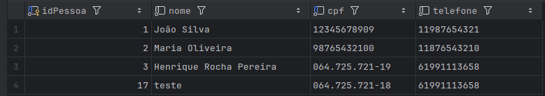
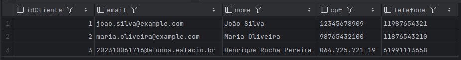
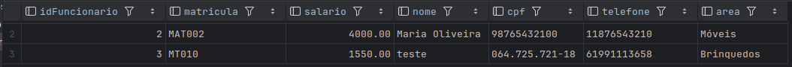
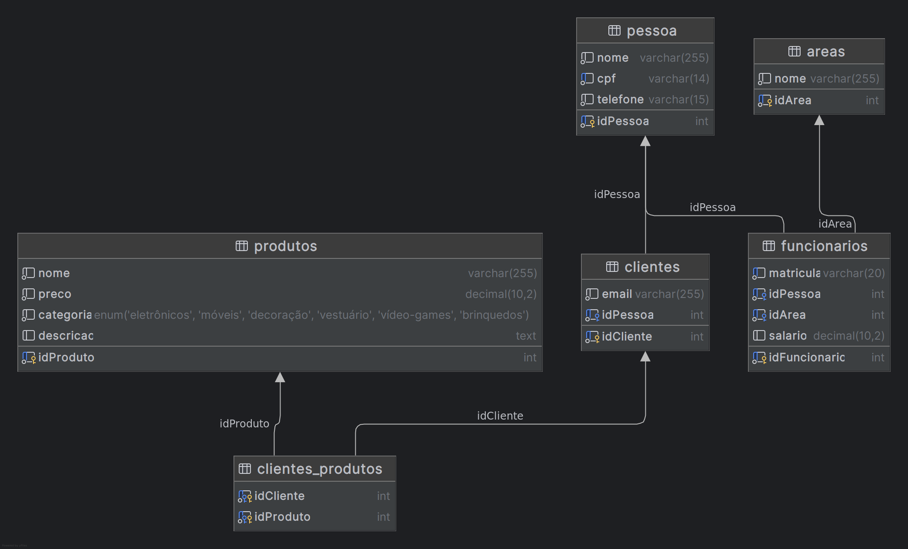

# Esquema do Banco de Dados: Sistema de Gerenciamento de Clientes e Produtos

## Índice

1. [Visão Geral](#visão-geral)
2. [Estrutura das Tabelas](#estrutura-das-tabelas)
   - [Tabela `pessoa`](#tabela-pessoa)
   - [Tabela `clientes`](#tabela-clientes)
   - [Tabela `areas`](#tabela-areas)
   - [Tabela `funcionarios`](#tabela-funcionarios)
   - [Tabela `produtos`](#tabela-produtos)
   - [Tabela `clientes_produtos`](#tabela-clientes_produtos)
3. [Inserções de Dados](#inserções-de-dados)
4. [Consultas Comuns](#consultas-comuns)
5. [Modelo Relacional](#modelo-relacional)

---

## Visão Geral

Este documento descreve o esquema do banco de dados utilizado no sistema de gerenciamento de clientes e produtos. O banco de dados é composto por seis tabelas principais: `pessoa`, `clientes`, `areas`, `funcionarios`, `produtos` e `clientes_produtos`.

---

## Estrutura das Tabelas

### Tabela `pessoa`

Armazena informações pessoais básicas.

```sql
CREATE TABLE pessoa (
    idPessoa INT PRIMARY KEY AUTO_INCREMENT,
    nome VARCHAR(255) NOT NULL,
    cpf VARCHAR(14) UNIQUE NOT NULL,
    telefone VARCHAR(15) NOT NULL
);
```

- **idPessoa**: Chave primária, identificador único da pessoa.
- **nome**: Nome completo da pessoa.
- **cpf**: CPF (Cadastro de Pessoa Física) da pessoa, valor único.
- **telefone**: Telefone de contato.

---

### Tabela `clientes`

Armazena informações dos clientes. Cada cliente está associado a uma pessoa.

```sql
CREATE TABLE clientes (
  idCliente INT PRIMARY KEY AUTO_INCREMENT,
  email VARCHAR(255) NOT NULL,
  idPessoa INT NOT NULL,
  FOREIGN KEY (idPessoa) REFERENCES pessoa(idPessoa)
);
```

- **idCliente**: Chave primária, identificador único do cliente.
- **email**: E-mail de contato do cliente.
- **idPessoa**: Chave estrangeira referenciando a tabela `pessoa`.

---

### Tabela `areas`

Armazena as áreas de atuação dos funcionários.

```sql
CREATE TABLE areas (
   idArea INT PRIMARY KEY AUTO_INCREMENT,
   nome VARCHAR(255) NOT NULL
);
```

- **idArea**: Chave primária, identificador único da área.
- **nome**: Nome da área (ex: Eletrônicos, Móveis).

---

### Tabela `funcionarios`

Armazena informações dos funcionários, associando-os a uma pessoa e a uma área de atuação.

```sql
CREATE TABLE funcionarios (
    idFuncionario INT PRIMARY KEY AUTO_INCREMENT,
    matricula VARCHAR(20) UNIQUE NOT NULL,
    idPessoa INT NOT NULL,
    idArea INT NOT NULL,
    salario DECIMAL(10, 2),
    FOREIGN KEY (idArea) REFERENCES areas(idArea),
    FOREIGN KEY (idPessoa) REFERENCES pessoa(idPessoa)
);
```

- **idFuncionario**: Chave primária, identificador único do funcionário.
- **matricula**: Matrícula única do funcionário.
- **idPessoa**: Chave estrangeira referenciando a tabela `pessoa`.
- **idArea**: Chave estrangeira referenciando a tabela `areas`.
- **salario**: Salário do funcionário.

---

### Tabela `produtos`

Armazena informações dos produtos disponíveis no sistema.

```sql
CREATE TABLE produtos (
  idProduto INT PRIMARY KEY AUTO_INCREMENT,
  nome VARCHAR(255) NOT NULL,
  preco DECIMAL(10, 2) NOT NULL,
  categoria ENUM('Eletrônicos', 'Móveis', 'Decoração', 'Vestuário', 'Vídeo-Games', 'Brinquedos') NOT NULL,
  descricao TEXT
);
```

- **idProduto**: Chave primária, identificador único do produto.
- **nome**: Nome do produto.
- **preco**: Preço do produto.
- **categoria**: Categoria do produto (ex: Eletrônicos, Móveis).
- **descricao**: Descrição detalhada do produto.

---

### Tabela `clientes_produtos`

Tabela de associação entre clientes e produtos, permitindo identificar quais produtos foram adquiridos por quais clientes.

```sql
CREATE TABLE clientes_produtos (
   idCliente INT NOT NULL,
   idProduto INT NOT NULL,
   PRIMARY KEY (idCliente, idProduto),
   FOREIGN KEY (idCliente) REFERENCES clientes(idCliente),
   FOREIGN KEY (idProduto) REFERENCES produtos(idProduto)
);
```

- **idCliente**: Chave estrangeira referenciando a tabela `clientes`.
- **idProduto**: Chave estrangeira referenciando a tabela `produtos`.

---

## Inserções de Dados

### Áreas

```sql
INSERT INTO areas (nome) VALUES ('Eletrônicos');
INSERT INTO areas (nome) VALUES ('Móveis');
INSERT INTO areas (nome) VALUES ('Decoração');
INSERT INTO areas (nome) VALUES ('Vestuário');
INSERT INTO areas (nome) VALUES ('Vídeo-Games');
INSERT INTO areas (nome) VALUES ('Brinquedos');
```

### Pessoas

```sql
INSERT INTO pessoa (nome, cpf, telefone) VALUES ('João Silva', '12345678909', '11987654321');
INSERT INTO pessoa (nome, cpf, telefone) VALUES ('Maria Oliveira', '98765432100', '11876543210');
```

### Clientes

```sql
INSERT INTO clientes (email, idPessoa) VALUES ('joao.silva@example.com', 1);
INSERT INTO clientes (email, idPessoa) VALUES ('maria.oliveira@example.com', 2);
```

### Funcionários

```sql
INSERT INTO funcionarios (matricula, idPessoa, idArea, salario) VALUES ('MAT001', 1, 1, 3000.00);
INSERT INTO funcionarios (matricula, idPessoa, idArea, salario) VALUES ('MAT002', 2, 2, 4000.00);
```

### Produtos

```sql
INSERT INTO produtos (nome, preco, categoria, descricao)
VALUES ('Televisor', 1500.00, 'Eletrônicos', 'Televisor 50 polegadas 4K');
INSERT INTO produtos (nome, preco, categoria, descricao)
VALUES ('Sofá', 1200.00, 'Móveis', 'Sofá de 3 lugares confortável');
INSERT INTO produtos (nome, preco, categoria, descricao)
VALUES ('Cadeira Gamer', 800.00, 'Vídeo-Games', 'Cadeira gamer ergonômica');
```

---

## Consultas Comuns

#### Listar Informações
```sql
  SELECT * FROM pessoa;
```

   
#### Buscar Pessoas que são clientes
```sql
SELECT c.idCliente, c.email, p.nome, p.cpf, p.telefone
FROM  clientes c
JOIN  pessoa p ON c.idPessoa = p.idPessoa;
```



#### Buscar Pessoas que são funcionários
```sql
SELECT f.idFuncionario, f.matricula, f.salario, p.nome, p.cpf, p.telefone, a.nome
    AS area
FROM funcionarios f
JOIN pessoa p ON f.idPessoa = p.idPessoa
JOIN areas a ON f.idArea = a.idArea
```

---

## Modelo Relacional

